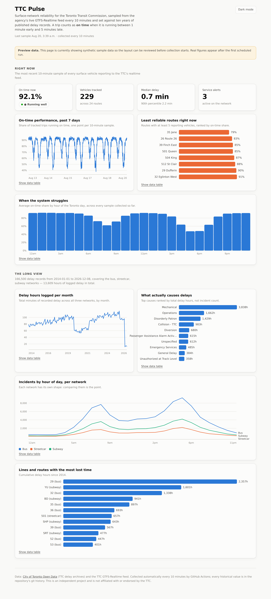

# TTC Pulse

A live reliability dashboard for the Toronto Transit Commission, and a ten-year
analysis of every delay the agency has published.

**Live dashboard →** `https://<your-github-username>.github.io/ttc-pulse/`



---

## What this does

Two data layers answer two different questions.

**The live layer** samples the TTC's GTFS-Realtime feed every 10 minutes and
measures how evenly spaced vehicles are on every surface route currently
reporting, appending the result to a growing archive. It answers *how is the
system running right now, and how has it run this week*.

**The historical layer** pulls the delay archives the City of Toronto publishes
monthly — roughly a million incident records across subway, bus and streetcar
going back to 2014 — normalises a decade of inconsistent schemas into one table,
and aggregates it. It answers *what actually causes delays, when do they happen,
and is it getting worse*.

### Why headway regularity rather than on-time performance

The obvious metric is schedule adherence. It is not computable from this feed,
and finding that out was the most instructive part of building this.

Inspecting the raw feed shows every TripUpdate carries
`schedule_relationship: NEW` with a synthetic negative trip_id, and every
StopTimeUpdate carries an absolute `arrival.time` with no `delay` field. `NEW`
means the trip has no counterpart in the published timetable — so there is no
scheduled arrival to subtract from the predicted one. It is a *prediction* feed,
not a schedule-deviation feed.

What it does support is the measure that matters more on frequent service: are
vehicles evenly spaced? For each route and stop, predicted arrivals are sorted,
consecutive gaps are taken, and each gap is classified against that stop's own
average headway — **bunched** below 50%, **gapped** above 150%, **regular** in
between. Bunching is the dominant failure mode of high-frequency transit, and a
rider who turns up without consulting a timetable feels it far more than
punctuality.

## How it works

```
GTFS-Realtime feed ──► collect_realtime.py ──► data/realtime/snapshots-YYYY-MM.csv
  (every 10 min)              │                        │
                              │                        └──► git commit (the database)
                              └──────────────────────► docs/data/live.json
                                                       docs/data/trend.json
                                                              │
Toronto Open Data  ──► build_history.py  ──► docs/data/history.json
  (monthly)                                                   │
                                                              ▼
                                                    docs/index.html (GitHub Pages)
```

There is no server and no database. GitHub Actions runs the collector on a
schedule and commits the output back to this repository, so the git history
*is* the time series — every value the dashboard has ever shown can be traced to
the commit that produced it. GitHub Pages serves `docs/` directly from the
branch. Total running cost: nothing.

## Setup

```bash
git clone https://github.com/<your-username>/ttc-pulse.git
cd ttc-pulse
make install            # or: pip install -r requirements.txt
make test               # offline test suite, no network needed
```

**1. Build the historical layer** (takes 10–30 minutes; it downloads ~40 archive
files):

```bash
make history
# or, for a faster first look:
python src/build_history.py --since 2022
```

**2. Take a live snapshot:**

```bash
make collect
```

**3. Preview locally:**

```bash
make serve      # http://localhost:8000
```

**4. Turn on automation.** Push the repo to GitHub, then:

- **Settings → Pages →** Source: *Deploy from a branch*, Branch: `main`, Folder: `/docs`
- **Settings → Actions → General →** Workflow permissions: *Read and write permissions*
- **Actions tab →** enable workflows

The collector starts on its own within ten minutes.

### Previewing without waiting for real data

```bash
make demo       # fills the dashboard with SYNTHETIC data and shows a banner
make reset      # deletes it again before you collect anything real
```

The demo data is clearly labelled in the UI. Always `make reset` before your
first real collection so synthetic rows never mix into the archive.

## Repository layout

| Path | What it is |
|---|---|
| `src/common.py` | paths, feed URLs, analysis constants |
| `src/aggregate.py` | all the arithmetic — pure functions, no I/O, fully unit-tested |
| `src/collect_realtime.py` | fetches and decodes the live feed, appends a snapshot |
| `src/build_history.py` | downloads and normalises the 2014-present delay archives |
| `docs/index.html` | the dashboard: one self-contained file, no build step, no CDN |
| `tests/` | offline test suite and the synthetic-data generators |
| `data/realtime/` | collected snapshots, one CSV per month |
| `.github/workflows/` | the schedules: collect, history, tests |

## Design decisions worth knowing about

**Medians, not means.** Headway distributions have a long right tail — a single
vehicle held at a terminal produces a gap several times the norm. Implausible
gaps are filtered at ingest (`gaps_from_times`), and every headline figure is a
median so whatever slips through the filter cannot drag the number.

**Minimum-sample floors in two places.** A stop needs at least three measured
headways before its regularity counts, and a route needs at least twelve before
it can be ranked. Without them, a route with one qualifying stop and three gaps
shows 0% regular and tops the "most irregular" list on pure noise.

**Missing data stays missing.** If every feed is unreachable, the run exits
without writing anything rather than recording a row of zeros. A gap in the
chart is honest; a false cliff is not.

**Monthly CSV partitions.** One ever-growing file would be rewritten on every
commit and the repository would balloon. One file per month keeps each commit's
diff to the handful of rows actually appended.

**No chart library.** The dashboard draws its own SVG. That keeps it to a single
file with no build step and no CDN dependency, which is what makes "push to
GitHub and it just works" true.

## Data sources and attribution

- [City of Toronto Open Data](https://open.toronto.ca/) — TTC subway, bus, streetcar
  and LRT delay archives, published under the
  [Open Government Licence – Toronto](https://open.toronto.ca/open-data-licence/)
- TTC GTFS-Realtime feed — `https://bustime.ttc.ca/gtfsrt/`

This is an independent project. It is not affiliated with, endorsed by, or
supported by the Toronto Transit Commission or the City of Toronto.

## Licence

MIT.
